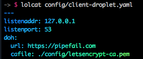

# homer

DNS over HTTPS implementation (IETF, _not_ google implementation)

Run a local resolver (`homer-client`) on your laptop, which receives DNS requests on `127.0.0.1:53`, and forwards them over HTTPS to `homer-server` for resolution.

# Client

Client listens on `53/udp` for DNS messages. It encodes them into HTTP requests and sends them to the server. It also decodes responses via HTTP and writes the decoded UDP response back to the DNS resolver.

# Server

Server listens on HTTP[S] for DNS over HTTP requests, decodes them, performs resolution, and returns the response.

This implements [https://tools.ietf.org/html/draft-ietf-doh-dns-over-https-02](https://tools.ietf.org/html/draft-ietf-doh-dns-over-https-02) and handles `/.well-known/dns-request` `GET` requests

# Building

```
$ make
```

# Running

## Client

```
$ sudo bin/homer-client -config config/client.yaml
2018/01/23 17:06:04 Listening for DNS on 127.0.0.1:53
```

Make sure you add your resolver into /etc/resolv.conf
```
echo "nameserver 127.0.0.1" |sudo tee /etc/resolv.conf
```

## Server

Builds happen automatically for the docker image: https://hub.docker.com/r/byxorna/homer-server

```
$ bin/homer-server -config config/server.yaml
2018/01/23 17:07:58 Listening on 0.0.0.0:9000
```

## Make DNS Requests

```
$ dig @127.0.0.1 -p 53 google.com
```

# Pretty Pictures

## Laptop




## Server


## It works!


# Links

* https://github.com/pforemski/dingo
* https://tools.ietf.org/html/draft-ietf-doh-dns-over-https-02
* https://developers.google.com/speed/public-dns/docs/dns-over-https
* https://datatracker.ietf.org/wg/doh/about/
* https://github.com/m13253/dns-over-https
